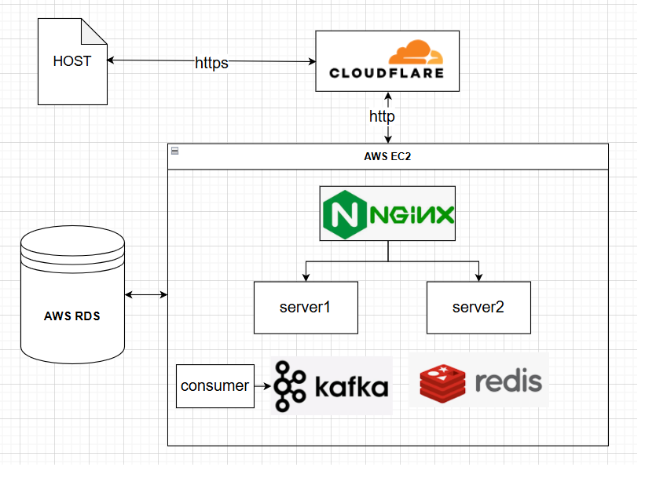

# shopping-website
A shopping website focus on backend technology using Node.js.

# Introduction
使用 express 架設網站，實作訂單流程，以 redis 做查詢和庫存扣減的緩存，kafka 在成立訂單時訂閱消費並寫入資料庫，實現基本的分布式業務。 

環境以 docker 建立應用，並以 github action 更新 aws 上的佈署。

<a href="https:/zhihanh.cc">DEMO 網址</a>。



# Basic funtion
1. 登入串接 google-auth，並以 jwt token 作為訪問驗證
2. 使用 orm sequelize 操作資料庫以及 migrate
3. 查詢商品時會先查緩存，若無緩存則加分布式鎖，待查詢資料庫寫回緩存後再釋放鎖
4. 商品會先加入購物車再進入訂單頁面，成立訂單時會在 redis 上判斷庫存扣減，以 lua 腳本確定執行的原子性
5. 訂單成立後將消息寫入 kafka，並返回付款頁面(藍新金流)，消費者之後再從 kafka 中取出並寫入資料庫，將耗時較久的操作異步執行。
6. <del>訂單成立後寫入延遲對列，超時取消訂單並返還庫存</del>
7. <del>ELK 寫帳</del>
8. 以 jmeter 驗證資料的一致性

# Environment
安裝 docker
```
sudo apt update && apt list --upgradable
curl -sSL https://get.docker.com | sudo sh
docker --version
```
直接執行 docker (不用 sudo) 
```
sudo groupadd docker
sudo gpasswd -a ${USER} docker
sudo service docker restart
重啟 shell
```
安裝 docker compose
```
sudo curl -L "https://github.com/docker/compose/releases/download/1.27.3/docker-compose-$(uname -s)-$(uname -m)" -o /usr/local/bin/docker-compose
sudo chmod +x /usr/local/bin/docker-compose
sudo ln -s /usr/local/bin/docker-compose /usr/bin/docker-compose
docker-compose --version
```
安裝 node 
```
curl -o- https://raw.githubusercontent.com/nvm-sh/nvm/v0.40.1/install.sh | bash
重啟 shell
nvm install 20.11.1
```
安裝 mysql-server (或是 phpmyadmin 修改設定)
```
sudo apt-get install mysql-server
```
登錄 aws rds 修改時區(一次性)和創建資料庫
```
mysql -u ${user} -h ${host} -p
grant `rds_superuser_role`@`%` TO `root`@`%`
set time_zone='+8:00';
show variables like '%time_zone%';

create database db;
show databases;
```
刪除 mysql-server
```
sudo service mysql stop && sudo apt-get purge --auto-remove mysql-server && sudo apt-get autoremove && sudo apt-get autoclean && sudo rm -rf /etc/mysql /var/lib/mysql
dpkg -l | grep mysql-server 
```
由於免費 ec2 內存只有 1G，容易內存不足而當機，所以開虛擬內存擴大容量
```
查看內存使用
free -h -s 2
清理內存
sync && sudo sh -c 'echo 1 >/proc/sys/vm/drop_caches' && sudo sh -c 'echo 2 >/proc/sys/vm/drop_caches' && sudo sh -c 'echo 3 >/proc/sys/vm/drop_caches'
```
創建 2G 虛擬內存
```
sudo mkdir -p /opt/swap
cd /opt/swap
sudo dd if=/dev/zero of=swap_2G bs=1024 count=2000000
sudo mkswap swap_2G

sudo chmod 600 swap_2G
sudo swapon swap_2G
free -h

sudo vi /etc/sysctl.conf
添加：vm.swappiness=15
sudo sysctl -p
cat /proc/sys/vm/swappiness

啟動時自動 mount
vi /etc/fstab
添加：/opt/swap/swap_2G        swap     swap    defaults    0     0
```
# Start
同自動佈署流程 .github/workflows
```
git clone https://github.com/hanbro0112/shopping-website.git
cd shopping-website
npm install
npm run migrate  
docker build -t my-web-app .
docker build -t my-consumer-app -f ./kafka/Dockerfile .
docker compose up
```
# Reference
Front-end template reference: https://themewagon.com/themes/free-bootstrap-ecommerce-template-electro/
